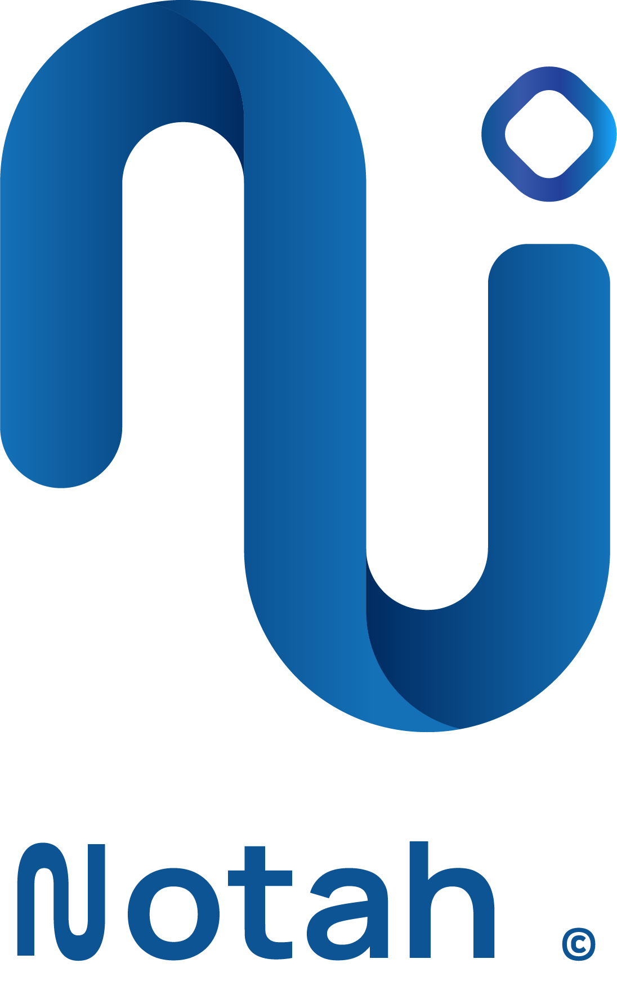

# Notah

A workspace app for freelancers to help them manage their businesses.

<p align="center">
  
</p>


[](https://flutter.dev)
[](https://dart.dev)
[](https://blog.cleancoder.com/uncle-bob/2012/08/13/the-clean-architecture.html)


---

## 📌 Project Status

🚧 Currently under active development.

## 🛠 Tech Stack
| Category               | Technology                                                                |
| ---------------------- |---------------------------------------------------------------------------|
| Framework              | [Flutter](https://flutter.dev)                                            |
| Language               | Dart                                                                      |
| Architecture           | Clean Architecture                                                        |
| State Management       | [BLoC (flutter_bloc)](https://pub.dev/packages/flutter_bloc)              |
| Functional Programming | [fpdart](https://pub.dev/packages/fpdart)                                 |
| Routing                | [GoRouter](https://pub.dev/packages/go_router)                            |
| Networking             | [Dio](https://pub.dev/packages/dio)                                       |
| Dependency Injection   | [GetIt](https://pub.dev/packages/get_it)                                  |
| Secure Storage         | [Flutter Secure Storage](https://pub.dev/packages/flutter_secure_storage) |
| Local Storage          | [Shared Preferences](https://pub.dev/packages/shared_preferences)         |
| Localization           | [Easy Localization](https://pub.dev/packages/easy_localization)           |
| Logging                | [Logger](https://pub.dev/packages/logger)                                 |


## 🎨 Design System

The application uses a custom design system including

- Custom Color Scheme
- Typography: [Manrope Fonts](https://fonts.google.com/specimen/Manrope)
- Theme Extensions
- Reusable Components
- Material 3

- Flutter SDK: `^3.13.0`
- Dart SDK: `^3.13.0`
- Android Studio / VS Code with Flutter extensions


### Installation

1. **Clone the repository**
   ```bash
   git clone https://github.com/yourusername/notah.git
   cd workmate
   ```

2. **Install dependencies**
   ```bash
   flutter pub get
   ```

3. **Run the application**
   ```bash
   flutter run
   ```

## 📸 Screenshots

---

## 🤝 Contributing

Contributions are welcome! Please feel free to submit a Pull Request.

1. Fork the Project
2. Create your Feature Branch (`git checkout -b feature/AmazingFeature`)
3. Commit your Changes (`git commit -m 'Add some AmazingFeature'`)
4. Push to the Branch (`git push origin feature/AmazingFeature`)
5. Open a Pull Request

## 📄 License

Distributed under the MIT License. See `LICENSE` for more information.

---
Developed with ❤️ by Amr Ashraf.

If you found this project helpful, consider giving it a ⭐.
